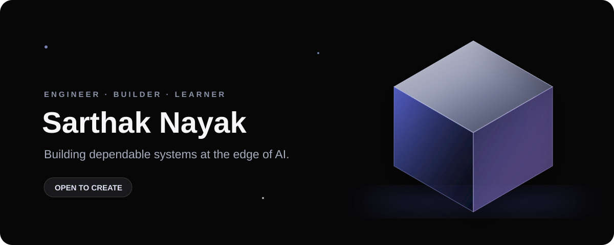

## Hi there 👋
<div align="center">
  
</div>

<br />

<div align="center">
  <a href="https://github.com/zartk-23?tab=followers"></a>
  
</div>

## About

I am **Sarthak Nayak** — a backend and AI-focused developer who likes systems that are useful, secure, and simple to explain.

```text
currently building  → VectorVault
interested in       → backend systems, RAG, cloud, system design
approach            → less noise, better engineering
```

## Selected work

<a href="https://github.com/zartk-23/Vector-vault">
  
</a>

**VectorVault** — tenant-safe semantic search and RAG infrastructure using FastAPI, PostgreSQL, Pinecone, Redis, and Docker.

## Stack

`Python` · `FastAPI` · `PostgreSQL` · `Docker` · `Pinecone` · `Redis` · `GitHub Actions`

<div align="center">
  
  
</div>

<div align="center">
  <sub>Quietly building things that work.</sub>
</div>
